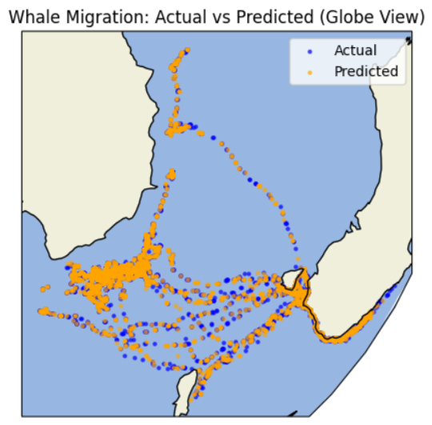
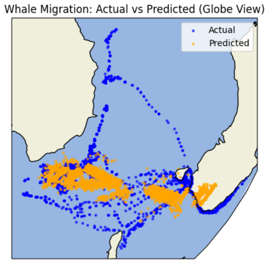
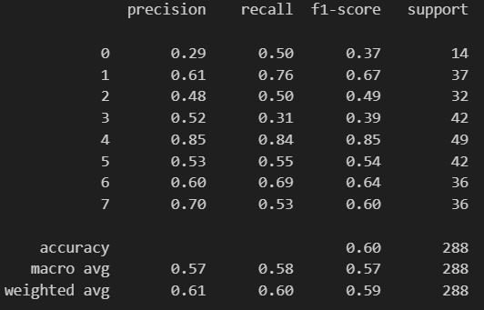

## About Me
Second-year Computer Science and Mathematics student at the University of York.
Interested in Data Science and Machine Learning.

## Projects 
- Whale Migration Predictor - A Simple introduction into ML models and visualisation. I exctracted data from an online migration database cleaned the data and put them into a nueral net on the right and a K nearest neighbours on the left. From this model we can see whales are very habitual in their migration patterns.

- Emotion Recognition System - audio feature extraction with a neural net for prediction

## Contact 
[GitHub](https://github.com/CallumRobertson-Cox)
 
