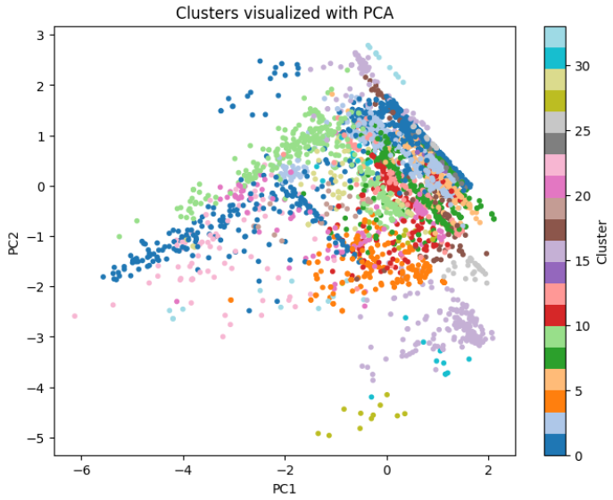

# About Me
Second-year Computer Science and Mathematics student at the University of York.
Interested in Data Analysis, Data Science, and Machine Learning.

# Projects 
## Customer Churn Analysis 
#### Built a churn analysis project combining Tableau dashboards and machine learning models to identify customer risk factors and visualize churn patterns. Focused on clarity, reproducibility, and actionable insights for stakeholders.
- Initial analysis was done in SQL, where I calculated churn percentages across categorical features.
- Data cleaning was also performed in SQL, converting string fields into numerical categories and removing null values, while retaining outliers to focus on real‑world churn reasons.
- Built visualizations in Python to gain deeper insights into the data.
- Trained an XGBoost model, evaluated with a confusion matrix, and extracted feature importance to highlight the strongest predictors of churn.
- Top three Features plotted on a dashboard in tableau 

## Music Recommendation System
#### Developed an application using the Spotify API that analyzes a user’s playlist and generates 1-10 song recommendations based on similarity metrics.
- Collected a dataset of both popular and independent songs and performed extensive preprocessing. This included clustering over 3,000 artists into 34 representative groups, one-hot encoding genre information, and cleaning additional audio and metadata features.

- Used the Spotipy API to extract audio features from a user’s Spotify playlist and generated a single feature vector representing the playlist's “average” song profile. Applied a K-Nearest Neighbors model to identify and recommend songs from the full dataset that best matched the user’s listening preferences.
 
- Built a user-friendly desktop interface using Tkinter, allowing users to input their Spotify credentials and select the number of recommendations they want. The system outputs personalized song recommendations directly through the GUI.
- Below shows the GUI for recommendations and a Cluster for the artists which scores 0.7 on the Silhouette Score.

## Emotion Recognition System 
#### Developed an application that analyzes speech input and predicts the speaker’s emotion using audio feature extraction and a machine learning model.
- Developed a pipeline to convert raw audio files into structured datasets of extracted audio features (e.g., MFCCs, chroma, spectral features).

- Trained a neural network on an online emotion-labeled dataset to classify audio into 8 distinct emotional categories using averaged audio features.

- Built an API and GUI that allow users to upload or record audio files, process them through the model, and receive real-time emotion predictions.
- Below shoes the GUI and a Classification Report for the CNN

## Contact 
[GitHub](https://github.com/CallumRobertson-Cox)
 
